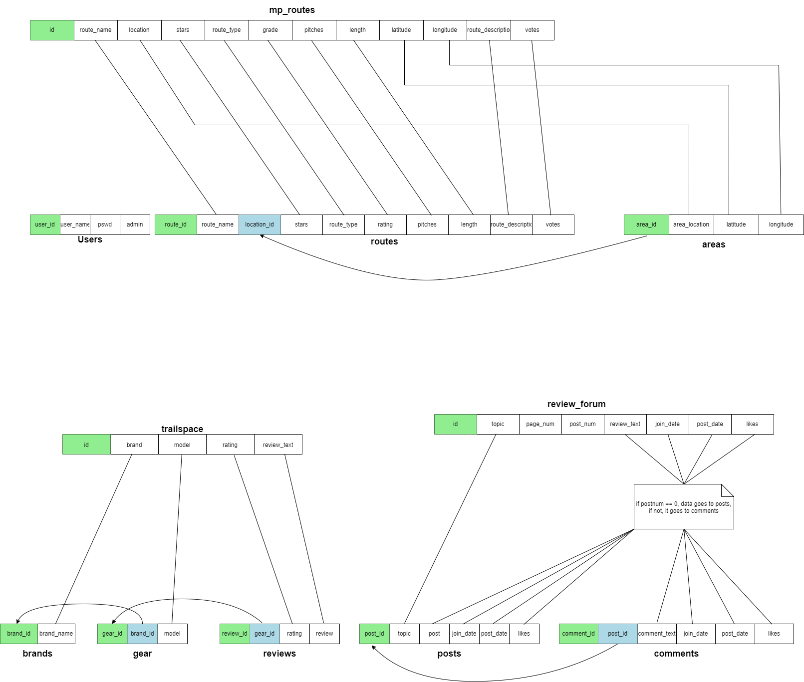

# Scripts for Normalizing Data
- This directory contains the scripts I used for normalizing the data from the dataset I used.
- Initially the data came 3 csv files, mp_routes.csv, trailspace.csv, and review_forum.csv.
- mp_routes was broken up into routes and areas; trailspace was broken up into brands, gear, and reviews; and review_forum was broken up into posts and comments.
- the diagram below describes the relationships between the original data and the normalized data.
